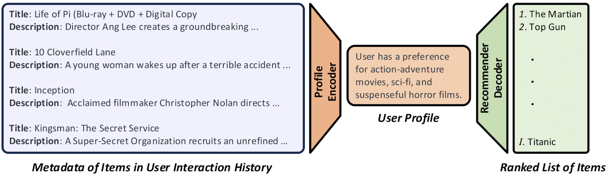

# End-to-end Training for Recommendation with Language-based User Profiles
Zhaolin Gao, Joyce Zhou, Yijia Dai, Thorsten Joachims



## Environment

```
torch>=2.1.0
transformers>=4.34
accelerate>=0.23
peft==0.6.2
bitsandbytes>=0.41.1
deepspeed>=0.10.3
vllm
tyro
scipy
rouge
shortuuid
jsonlines
rich
wandb
tensorboard
pandas
evaluate
```

## Data Generation

Our preprocessed datasets for Amazon-Movie-TV are available on Huggingface: [items](https://huggingface.co/datasets/Cornell-AGI/amazon_movie_tv_item_mxbai), [sessions](https://huggingface.co/datasets/Cornell-AGI/amazon_movie_tv_llama_mxbai).

To process your own dataset, please follow the following steps:

1. Use the notebook in `data/proces_data_review.ipynb` to filter sessions and items with a small number of interactions, long descriptions, and split the sessions into train and test sets.

2. Tokenize the item descriptions and session prompts with [Gemma](https://huggingface.co/google/gemma-2b-it) and [MxBai](https://huggingface.co/mixedbread-ai/mxbai-embed-large-v1) tokenizers by running:
```
python ./data/tokenize_for_gemma_mxbai.py --hf_item_repo HF_ITEM_REPO --hf_gemma_sess_repo HF_GEMMA_SESS_REPO
```
`HF_ITEM_REPO`: the huggingface repo to save the tokenized item descriptions using MxBai tokenizers.

`HF_GEMMA_SESS_REPO`: the huggingface repo to save the tokenized sessions using Gemma tokenizers.

3. Select the item that the user (for a session) would interact in the future and split the dataset into train/validation/test with:
```
python ./data/reprocess_data.py --hf_gemma_sess_repo HF_GEMMA_SESS_REPO
```
`HF_GEMMA_SESS_REPO`: the same huggingface repo with Gemma tokenizers as above.

4. Retokenize for with Llama tokenizer to train Llama models:
```
python ./data/reprocess_data_for_llama.py --hf_gemma_sess_repo HF_GEMMA_SESS_REPO --hf_llama_sess_repo HF_LLAMA_SESS_REPO
```
`HF_GEMMA_SESS_REPO`: the same huggingface repo with Gemma tokenizers as above.

`HF_LLAMA_SESS_REPO`: the huggingface repo to save the tokenized sessions using Llama tokenizers.

## Training

We now can train the Gemma model by running:
```
accelerate launch --config_file accelerate_cfgs/deepspeed_config.yaml \
                  --main_process_port 29080 --num_processes 4 \
                      src/langptune_gemma.py \
                      --num_lm_updates 200 \
                      --num_emb_updates 800 \
                      --num_iterations 5 \
                      --gradient_accumulation_steps 16 \
                      --per_device_train_batch_size 1 \
                      --emb_per_device_train_batch_size 32 \
                      --print_sample_output_freq 100 \
                      --lr 1e-7 \
                      --emb_lr 1e-7 \
                      --task.query_dataset HF_GEMMA_SESS_REPO \
                      --task.item_dataset HF_ITEM_REPO \
                      --reward_type ndcg \
                      --exp_name EXP_NAME_FOR_WANDB \
                      --eta 1.0 \
                      --whiten_rewards \
                      --kl_coef 0.2 \
                      --emb_model mixedbread-ai/mxbai-embed-large-v1 \
                      --lm_model google/gemma-2b-it \
                      --lora_rank 1024 \
                      --lora_alpha 2048
```
`num_processes`: number of GPUs to use.

`num_lm_updates`: number of iterations to train the language model.

`num_emb_updates`: number of iterations to train the embedding model.

`num_iterations`: total number of iterations.

`gradient_accumulation_steps`, `per_device_train_batch_size`: number of gradient accumulations and per device batch size. (batch size for language model = num_processes * gradient_accumulation_steps * per_device_train_batch_size)

`emb_per_device_train_batch_size`: per device batch size for training the embedding model.

`lr`: learning rate for the language model.

`emb_lr`: embedding model learning rate.

`task.query_dataset`: path to the tokenized sessions.

`task.item_dataset`: path to the tokenized item descriptions.

`reward_type`: metric to be used as reward (ndcg, mrr).

`eta`: hyperparameter in the loss function.

`kl_coef`: hyperparameter to control the KL regularization.

Here we use LoRA to update the language model and perform full parameter tunning for the embedding model.

Similarly, we can train the Llama model by running:
```
accelerate launch --config_file accelerate_cfgs/deepspeed_config.yaml \
                  --main_process_port 29080 --num_processes 4 \
                      src/langptune_llama.py \
                      --num_lm_updates 500 \
                      --num_emb_updates 2500 \
                      --num_iterations 5 \
                      --gradient_accumulation_steps 16 \
                      --per_device_train_batch_size 1 \
                      --emb_per_device_train_batch_size 32 \
                      --print_sample_output_freq 500 \
                      --lr 3e-7 \
                      --emb_lr 3e-7 \
                      --task.query_dataset HF_LLAMA_SESS_REPO \
                      --task.item_dataset HF_ITEM_REPO \
                      --reward_type ndcg \
                      --exp_name EXP_NAME_FOR_WANDB \
                      --eta 1.0 \
                      --whiten_rewards \
                      --kl_coef 0 \
                      --emb_model mixedbread-ai/mxbai-embed-large-v1 \
                      --lm_model meta-llama/Meta-Llama-3-8B-Instruct \
                      --num_layers_unfrozen 4
```
Here, we only train the last `num_layers_unfrozen` of the Llama model which keep other layer frozen and perform full parameter tunning for the embedding model.


